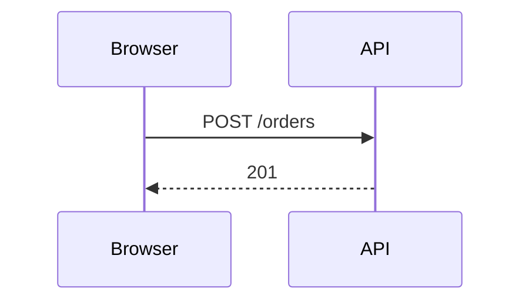

# Rich content — what a sheet can show besides text

A brief, a spec or a ticket is read on a screen by people who did not write it. A diagram or a
small interactive page often says in one look what three paragraphs do not. Castalie renders four
kinds of rich content, but not in every field — and a block written in the wrong field shows up
as raw code, or does not show at all.

## Where each kind renders

| Sheet | Field (buffer section / MCP parameter) | On the sheet | ```illustration | ```mermaid |
|---|---|---|---|---|
| Brief | `executive`, `problem`, `vision`, `out-of-scope` | yes | yes | yes |
| Spec | `executive`, `problem`, `solution` | yes | yes | yes |
| Ticket | `description`, `technical-detail` | yes | yes | yes |
| Spec phase | `objective_md` | yes | no — shows as code | yes |
| Spec phase | `action_plan_md`, `validation_criterion_md` | **no** | — | — |
| Spec acceptance test | `verification_md` | yes | no — shows as code | yes |
| Thread message | `discussion_post` body | yes | no — shows as code | yes |

**`action_plan_md` and `validation_criterion_md` are displayed nowhere.** They are stored and
returned by `feature_spec_get`, so they are the right place for what the next *agent* needs —
the plan, the case table, the coverage evidence — and the wrong place for anything a *person*
must see. Put that in the phase's objective, or in the spec's `solution`.

The bodies that take an illustration are exactly the sections of the `cs content` buffer: write
them there, never as a tool argument.

## ```illustration — one complete HTML page, run in place

````markdown
```illustration title="Checkout funnel" height=480
<!doctype html>
<html>…inline CSS and scripts, canvas, SVG…</html>
```
````

- `title` and `height` (pixels) are optional.
- The page runs in an **isolated frame**: no cookie, no storage, no access to the sheet around it.
- Scripts and stylesheets load only from `cdnjs.cloudflare.com` and `cdn.jsdelivr.net`; fonts also
  from Google Fonts. **No other network access** — no `fetch`, no remote image: embed data in the
  page, and images as `data:` URIs.
- When the page itself contains a line of three backticks, fence the block with **four**.
- Ceilings: **256 KiB per illustration, 8 illustrations and 1 MiB per sheet.** Beyond that the
  whole write is refused — `illustration_too_large` or `too_many_illustrations` — and nothing is
  saved, the other fields included.
- An instance can switch illustrations off; the block then shows as code. Look at the sheet once
  after the first push.

Use it for what a static diagram cannot carry: a chart built from real figures, a clickable
mock-up of a screen, a before/after comparison.

## ```mermaid — a diagram from text

````markdown

````

Renders in every field the sheet shows, the phase objective included. Prefer it for flows,
sequences, states and dependencies: it is small, diffable, and it renders where an illustration
does not. Mermaid runs with `securityLevel: "strict"` — no click handlers, no HTML labels.

## Raw HTML — text tags only

Raw HTML in a body is filtered to text tags: `p br b strong em i u s strike del a span div
blockquote pre code ul ol li h1–h6 hr table thead tbody tfoot tr td th img figure figcaption`, with
`class` everywhere and a few attributes (`href`, `src`, `alt`, `width`, `height`, `colspan`,
`rowspan`, `start`). **No `svg`, `iframe`, `style`, `script` nor `style=` attribute** — anything
else is written back as text. For a drawing, use Mermaid or an illustration.

## An image attached to the sheet

Attach the file to the sheet's thread with `discussion_attachment_upload` (base64, 16 MiB at
most), then reference the returned attachment id from any body:

| Sheet | Markdown |
|---|---|
| Brief | `` |
| Spec | `` |
| Ticket | `` |

Use it for a screenshot of the running product — the one kind of evidence neither Mermaid nor
an illustration can fake.
